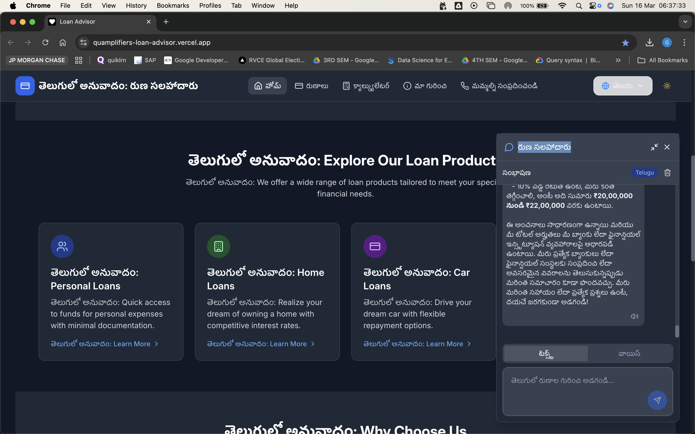

# Multilingual Loan Advisor

A multilingual loan advisory application developed for Track 2 of the Great Bengaluru Hackathon. This application helps users get loan-related information and advice in their preferred language.


## 🌟 Features

- **Multilingual Support**: Seamlessly switch between multiple Indian languages
- **Voice Interaction**: Support for speech-to-text and text-to-speech in multiple languages
- **Real-time Translation**: Dynamic content translation using advanced language models
- **Responsive Design**: Works perfectly on both desktop and mobile devices
- **Dark/Light Mode**: Customizable theme for better user experience
- **AI-Powered Advice**: Intelligent loan recommendations using Sarvam AI

## 🛠️ Technology Stack

- **Frontend**: React with TypeScript
- **Styling**: Tailwind CSS
- **Icons**: Lucide React
- **Routing**: React Router
- **State Management**: React Context API
- **API Integration**: Fetch API with CORS support

## 📚 Project Structure

```
src/
├── components/
│   ├── FloatingChatbot/     # AI chatbot interface
│   ├── LanguageSelector/    # Language switching component
│   ├── MainLayout/          # Main application layout
│   ├── ThemeToggle/        # Theme switching component
│   └── VoiceRecorder/      # Voice input component
├── contexts/
│   ├── LanguageContext/    # Language state management
│   └── ThemeContext/      # Theme state management
├── services/
│   ├── api.ts             # API integration
│   └── sarvamAI.ts        # Sarvam AI service integration
└── pages/
    ├── Home/              # Landing page
    ├── Loans/            # Loan information
    ├── Calculator/       # Loan calculator
    ├── About/           # About page
    └── Contact/         # Contact information
```

## 🔌 API Integration

### Sarvam AI API
The Sarvam AI API provides advanced language processing capabilities for our application:

- **Speech-to-Text API**
  - Converts voice input to text in multiple Indian languages
  - Supports real-time transcription
  - Handles multiple audio formats

- **Text-to-Speech API**
  - Converts text responses to natural-sounding speech
  - Supports multiple Indian languages
  - Provides voice customization options

- **Translation API**
  - Translates content between Indian languages
  - Maintains context and meaning during translation
  - Supports real-time translation

### Custom Loan Advisory API
Our custom API handles loan-related queries and provides intelligent responses:

- **Base Endpoint**: `/ask`
- **Request Format**:
  ```json
  {
    "question": "your question here"
  }
  ```
- **Features**:
  - Processes English text queries
  - Returns contextual loan advice
  - Integrates with translation services for multilingual support

## 🚀 Getting Started

1. Clone the repository:
   ```bash
   git clone [repository-url]
   ```

2. Install dependencies:
   ```bash
   cd multilingual-loan-sarvam
   npm install
   ```

3. Set up environment variables:
   ```bash
   cp .env.example .env
   # Add your API keys and endpoints
   ```

4. Start the development server:
   ```bash
   npm run dev
   ```

## 🔧 Configuration

Create a `.env` file with the following variables:
```env
VITE_SARVAM_API_KEY=your_api_key_here
VITE_SARVAM_API_ENDPOINT=your_endpoint_here
VITE_CUSTOM_API_ENDPOINT=your_custom_api_endpoint
```

## 🌐 Supported Languages

- English (en-IN)
- Hindi (hi-IN)
- Kannada (kn-IN)
- Tamil (ta-IN)
- Telugu (te-IN)
- Malayalam (ml-IN)
- Bengali (bn-IN)
- Marathi (mr-IN)
- Gujarati (gu-IN)

## 🤝 Contributing

1. Fork the repository
2. Create your feature branch (`git checkout -b feature/AmazingFeature`)
3. Commit your changes (`git commit -m 'Add some AmazingFeature'`)
4. Push to the branch (`git push origin feature/AmazingFeature`)
5. Open a Pull Request

<p align="center">
  
  
</p>

## 📄 License

This project is licensed under the GNU General Public License v3.0. This means:

- You can freely use, modify, and distribute this software
- Any modifications must also be open source under GPL-3.0
- You must include the original copyright notice
- No warranty is provided

For more details, see the [LICENSE](LICENSE) file.

## 🏆 Great Bengaluru Hackathon - Track 2

This project was developed as part of Track 2 of the Great Bengaluru Hackathon, which focused on:
- Creating innovative solutions for financial inclusion
- Leveraging technology to break language barriers
- Making financial services accessible to all Indians
- Promoting digital literacy and financial awareness

## 👥 Team

- Aditya Ranjan
- Gnanendra Naidu N
- Mihir Shriniwas Arya

## 🙏 Acknowledgments

- Sarvam AI for providing the AI and language processing capabilities
- Great Bengaluru Hackathon organizers
- All contributors and supporters

## 📞 Support

For any questions or issues:
- Open an issue in the GitHub repository
- Contact the development team
- Check the documentation for common solutions
